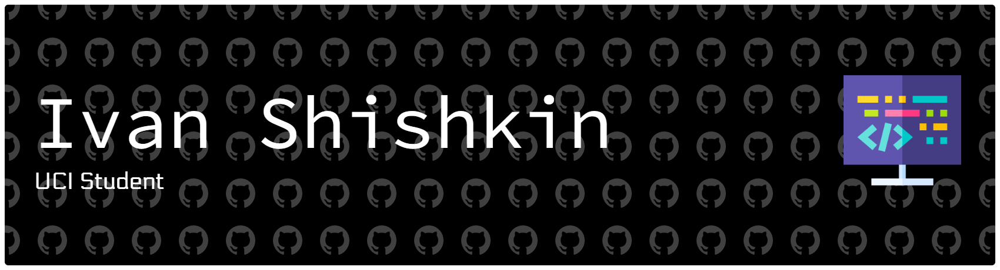

CS student at UC Irvine building practical skills beyond the classroom. Currently focused on developing a wide understanding of the field of Software Development.

## What I'm working with
- **Frontend**: React, Three.js, advanced animations, and more
- **Languages**: JavaScript, C++, R, Python, and more
- **Learning**: Staying current with modern dev tools and frameworks, and more

## Current focus
Self-teaching different frameworks outside of the classroom and staying on top of my classroom work. I prefer iterative improvement and actually building things over just theory.
Check out some of the projects I am working on below! 

When I'm not coding, I'm working, preparing for student leadership roles, hanging out with friends, or at the gym!

**Portfolio**: [your-portfolio-url]
**LinkedIn**: [your-linkedin]
